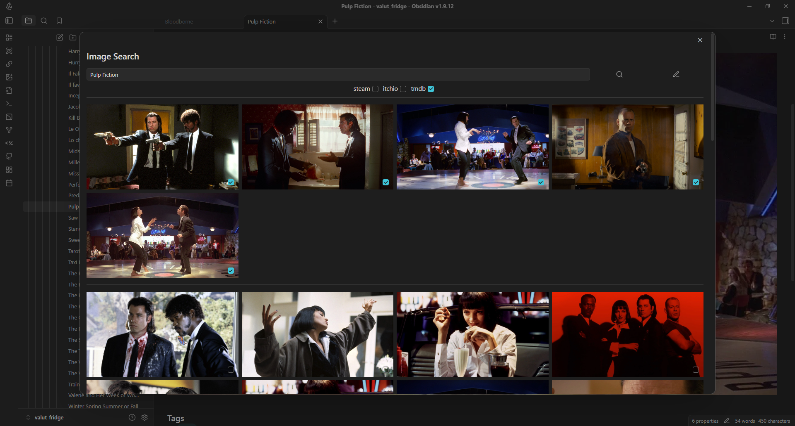
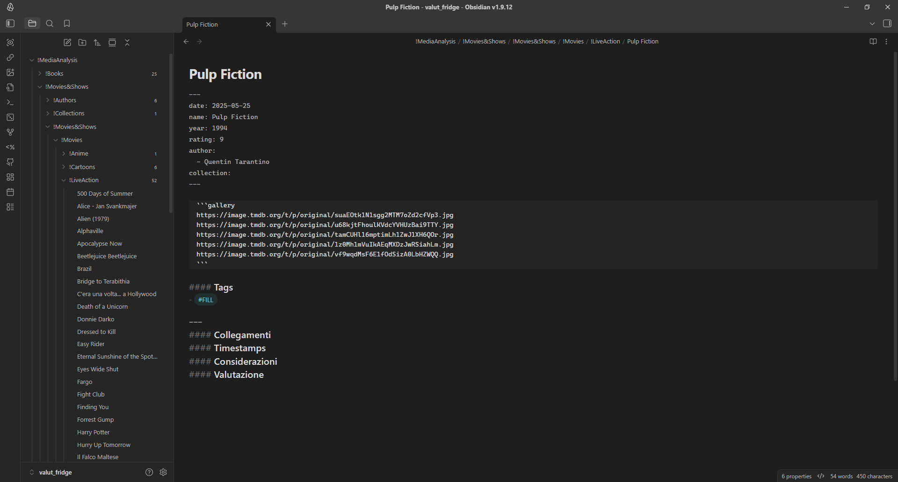
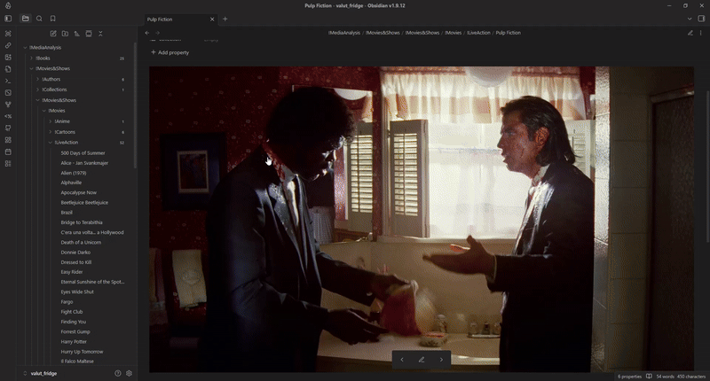
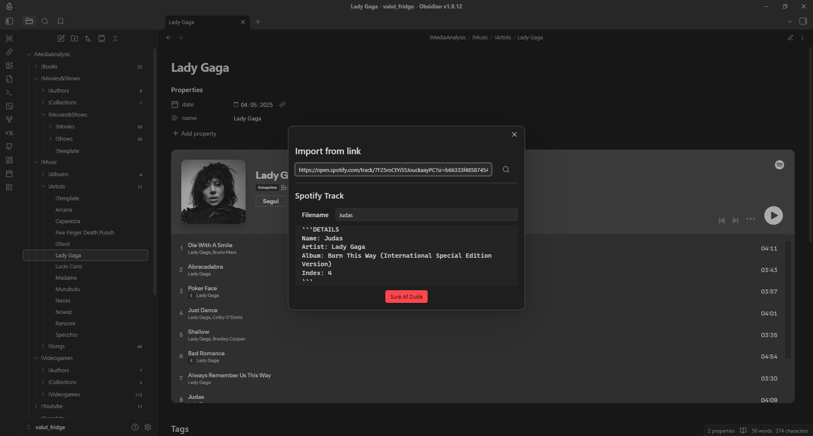
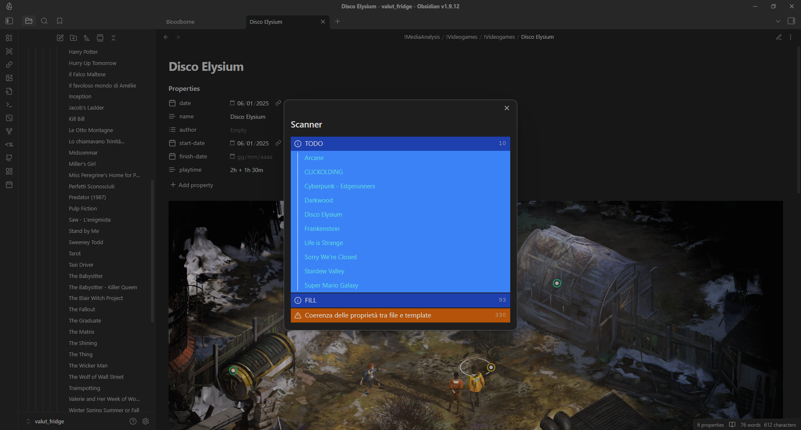

# TsKx (TypeScript picKaXe)

## Intro
Ho iniziato a sviluppare questa estensione di obsidian per facilitare l'archiviazione di media nel mio database.

Il progetto è stato pensato per essere ben organizzato, facilmente mantenibile e estendibile a distanza di molto tempo. Per questi motivi ho cercato di prestare massima attenzione alla struttura del codice.

Si tratta di una serie di tool comodi per la gestione del mio archivio personale, che presenta musica, film, videogiochi, anime e libri.

### Image Scraper
Si tratta di una finestra che ho programmato per facilitare la scelta delle immagini da aggiungere alla carousel di ogni opera.

Quando viene premuto il tasto cerca, dopo aver inserito il titolo e aver selezionato gli scraper da attivare per questa ricerca, il programma si occuperà di cercare immagini dai siti selezionati le elencherà in una griglia.

Ogni immagine e affiancata da una checkbox per facilitare la selezione di molteplici elementi.

Le immagini visualizzate nella prima griglia di immagini sono quelle già presenti nella carousel e possono essere comodamente rimosse deselezionando la checkbox corrispondente.



I link alle varie immagini vengono collezionati e stampati come testo (uno per riga) in una gallery, un elemento custom che ho programmato per assenza di alternative migliori.



Questo elemento, quando si passa dalla modalità di modifica a quella di visualizzazione si trasforma in una carousel che ho scritto da zero in typescript vanilla.



### Import From Link

Da quando ho iniziato a includere la musica in questa raccolta, mi sono reso conto che ci voleva più tempo a aggiungere manualmente una canzone alla collezione piuttosto che ascoltarla... e dopo un po' si è dimostrato non esattamente comodo.

Ho quindi optato per sfruttare l'API di Spotify. Ora basta incollare il link della canzone / artista / album e in automatico verranno recuperate tutte le informazioni e organizzate in documenti nelle apposite cartelle.

Eventualmente, con poca difficoltà, è possibile estendere l'import automatico per media che vanno oltre alla musica, ma al momento non ne ho necessità.



### Issues Scanner

Questa è l'ultima feature a cui ho lavorato prima di mettere in pausa il progetto, si tratta di uno scanner che usando regex e criteri vari, segnala tutti i file in cui ci sono cose che non vanno o da modificare.

Al momento segnala solo i file che contengono i tag #TODO o #FILL, ma avevo in programma di far notificare i file che non rispettano i template da cui sono stati generati, con annesso pulsante pre un fix automatico.

Un problema del me del futuro quando tornerà a lavorare al progetto :)



## Cmd
```cli
npm run dev
```